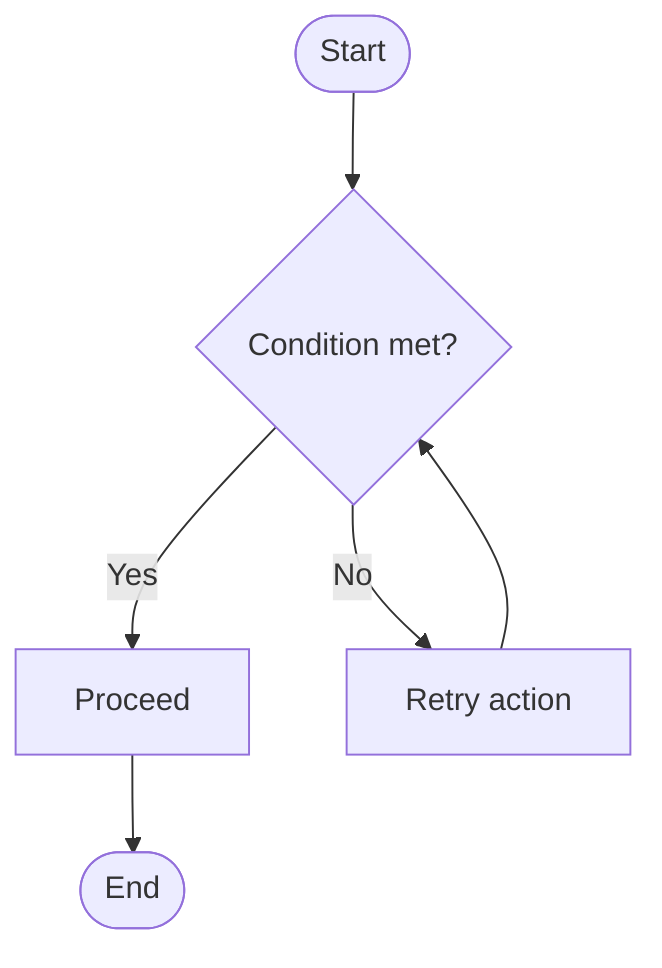

# Mermaid Activity Diagram Skill

Use when modeling procedural flow and decision logic.

## Intent

- Capture control flow, branching logic, retries, and exceptional exits.
- Make decision guards explicit enough to test.

## Canonical Skeleton

## Required Modeling Rules

- Use `flowchart TD` for readability unless process is explicitly horizontal.
- Always include explicit `Start` and `End` markers.
- Decisions must use guard labels (`Yes/No`, `Valid/Invalid`, `Success/Failure`).
- Include failure exits for external dependencies (auth, DB, network) where applicable.
- Use loops for retries and re-entry, not duplicate branches.

## Flowchart Safety Notes

- Avoid lowercase `end` token in node text; use `End` or quoted label.
- If node labels include special characters, wrap in quotes.
- Use subgraphs for lane-like grouping (Client/API/Domain/Data) when process spans layers.

## Depth Requirements

- Minimum 12 nodes in production workflows.
- Minimum 12 transitions.
- At least:
  - one retry loop
  - one failure path
  - one post-success continuation

## Anti-Patterns

- Avoid generic labels like `Process`, `Do stuff`, `Handle`.
- Avoid missing guards on decision edges.
- Avoid dead-end nodes without explicit terminal semantics.

## Update Protocol

- Keep branch labels stable when logic is unchanged.
- If business rules change, update guard wording and downstream paths together.

## Validation

- Every decision has at least two outgoing labeled branches.
- No unreachable nodes.
- Failure and success paths both terminate or rejoin intentionally.

## References

- https://mermaid.js.org/syntax/flowchart.html
- https://mermaid.js.org/intro/syntax-reference.html
