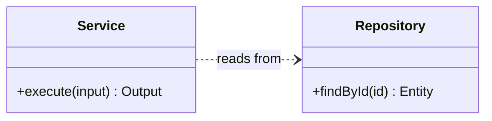

# Mermaid Class Diagram Skill

Use when building or updating UML Class diagrams in Mermaid.

## Intent

- Represent static structure, not runtime call sequence.
- Capture architecture boundaries and ownership clearly.
- Preserve stable class names across updates.

## Canonical Skeleton

## Required Modeling Rules

- Start with `classDiagram`.
- Set explicit direction (`LR` for broad architecture, `TB` for tall dependency stacks).
- Use Mermaid-supported relationship operators exactly:
  - `<|--` inheritance
  - `*--` composition
  - `o--` aggregation
  - `-->` association
  - `--` solid link
  - `..>` dependency
  - `..|>` realization
  - `..` dashed link
- Add relationship labels whenever intent is non-obvious.
- Use multiplicity where relevant: `"1"`, `"0..1"`, `"1..*"`, `"*"`.

## Class Content Rules

- Use visibility prefixes for members where meaningful: `+`, `-`, `#`, `~`.
- Use methods with parentheses and optional return type.
- Include annotations when useful:
  - `<<interface>>`
  - `<<abstract>>`
  - `<<service>>`
  - `<<enumeration>>`
- Keep members concise: include only attributes/operations that aid reasoning.

## Architecture Depth Requirements

- Minimum 8 classes for service-based systems.
- Minimum 10 labeled relationships.
- Must include at least:
  - one boundary/controller class
  - one domain/service class
  - one persistence/repository class
  - one core entity/value object

## Anti-Patterns

- Avoid using class diagrams to show request chronology.
- Avoid unlabeled relation spam where all edges look identical.
- Avoid duplicate class names with only cosmetic differences.
- Avoid putting business workflow steps as class names.

## Update Protocol

- Preserve existing class IDs/names unless a domain rename is explicitly requested.
- Prefer additive extension over full rewrites.
- If relation semantics change, update both operator and label.

## Validation

- Parse cleanly in Mermaid renderer.
- No orphan classes unless intentionally isolated.
- Relationship direction and multiplicity match code/domain contracts.

## References

- https://mermaid.js.org/syntax/classDiagram.html
- https://mermaid.js.org/intro/syntax-reference.html
