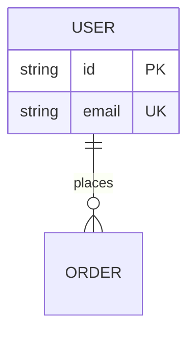

# Mermaid ERD Diagram Skill

Use when describing persistent data structures and cardinality constraints.

## Intent

- Model persistent entities and data invariants.
- Make ownership, optionality, and cardinality testable.

## Canonical Skeleton

## Required Modeling Rules

- Start with `erDiagram`.
- Prefer singular entity names; uppercase style recommended for readability.
- Label all relationships from first-entity perspective (`places`, `contains`, `belongs_to`).
- Use crow's foot cardinality operators consistently.
- Use identifying vs non-identifying relation semantics intentionally:
  - `--` identifying
  - `..` non-identifying

## Attribute Rules

- Include attributes that clarify keys and constraints.
- Use key markers where useful:
  - `PK`
  - `FK`
  - `UK`
  - combos like `PK, FK`
- Add attribute comments only when needed to clarify domain constraints.

## Cardinality Requirements

- Minimum 6 entities for medium systems.
- Minimum 8 relationships.
- Must include examples of:
  - one-to-one
  - one-to-many
  - optional relationships (`o|`, `o{`) where domain requires

## Foreign Key Inclusion Policy

- For logical models: omit redundant FK attributes when relationships already convey intent.
- For physical schema communication: include FK attributes explicitly.

## Anti-Patterns

- Avoid plural entity names that collide with table naming conventions unless required.
- Avoid ambiguous relation labels like `has` everywhere.
- Avoid contradictory cardinality and attribute key design.

## Update Protocol

- Preserve entity names unless schema migration explicitly renames them.
- Update relationship and attribute blocks together when constraints change.

## Validation

- Cardinality reflects real domain rules.
- Key constraints are coherent with relationships.
- Entity names align with actual codebase models.

## References

- https://mermaid.js.org/syntax/entityRelationshipDiagram.html
- https://mermaid.js.org/intro/syntax-reference.html
