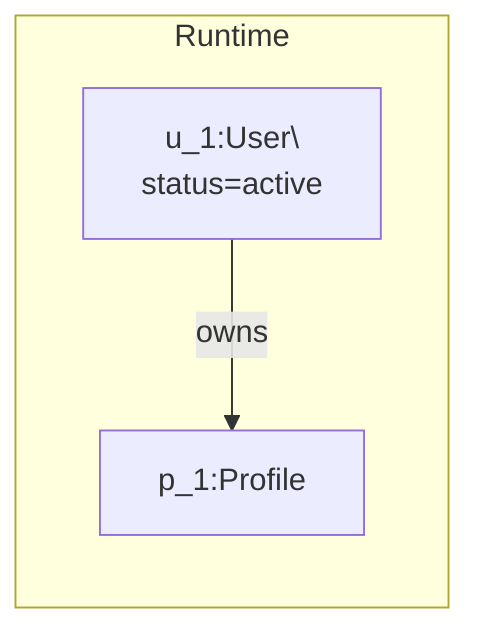

# Mermaid Object Diagram Skill

Use when showing runtime instances at a specific moment in time.

## Intent

- Mermaid has no native UML object diagram keyword, so use `flowchart` as a disciplined object-snapshot representation.
- Model concrete instances and state values, not abstract types.

## Canonical Skeleton

## Required Modeling Rules

- Use `flowchart LR` unless vertical stacking is explicitly better.
- Name nodes as `instanceId:ClassName`.
- Include only state attributes that matter to the scenario.
- Label every edge with runtime meaning (`owns`, `references`, `queued in`, `belongs to`).
- Use subgraphs to separate concerns (client/runtime/infra).

## Depth Requirements

- Minimum 8 instances for production snapshots.
- Minimum 8 relationships.
- Must include at least one transient object:
  - request
  - session
  - event
  - socket room

## Anti-Patterns

- Avoid abstract terms like `UserService` in object diagrams.
- Avoid class-only attributes with no runtime value.
- Avoid mixing unrelated time slices in one snapshot.

## Update Protocol

- Keep instance naming stable (`u_101`, `m_77`, etc.) across revisions when possible.
- If scenario changes, note old snapshot invalidation in the update message.

## Validation

- All nodes represent concrete instance snapshots.
- Every edge reflects an active relation in the chosen scenario moment.
- Snapshot remains readable without the class diagram.

## References

- https://mermaid.js.org/syntax/flowchart.html
- https://mermaid.js.org/intro/syntax-reference.html
