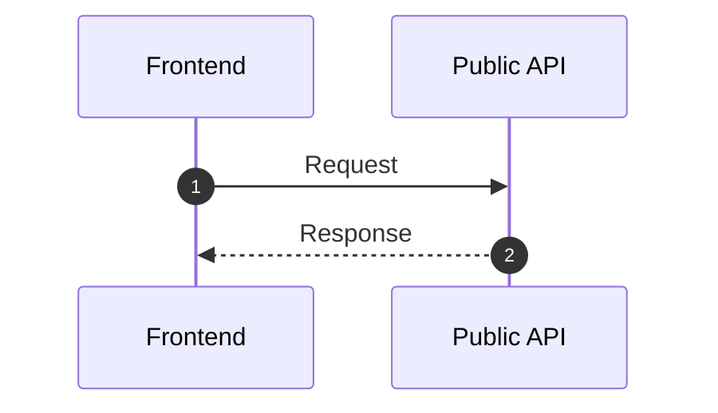

# Mermaid Sequence Diagram Skill

Use when modeling request/response and event interactions over time.

## Intent

- Show chronological collaboration and responsibility boundaries.
- Make success, alternate, and failure paths explicit.

## Canonical Skeleton

## Required Modeling Rules

- Start with `sequenceDiagram`.
- Use `autonumber` for traceability.
- Declare participants explicitly in intended visual order.
- Prefer aliases with `as` to keep labels readable.
- Use arrow semantics consistently:
  - `->>` sync request
  - `-->>` async/response
  - `-)` open async send where needed
  - `-x` termination/error handoff where needed
- Use `activate`/`deactivate` or `+`/`-` shortcuts to show processing ownership.

## Advanced Blocks (Use Where Applicable)

- `alt` / `else` for branching outcomes.
- `opt` for optional fragment.
- `loop` for retries/polling.
- `par` and `and` for parallel branches.
- `critical` and `option` for must-succeed sections with contingency outcomes.
- `break` for explicit abort paths.
- `rect rgb(...)` for visual grouping of a phase.

## Participant Typing Guidance

- Use Mermaid participant type config where useful:
  - boundary
  - control
  - entity
  - database
  - queue

## Depth Requirements

- Minimum 6 participants in service-oriented flows.
- Minimum 12 messages.
- At least one alternate branch and one failure/exception path.

## Anti-Patterns

- Avoid skipping middle-layer services for convenience.
- Avoid unlabeled messages (`do`, `call`, `process`) without intent.
- Avoid mixing unrelated scenarios in one sequence.

## Update Protocol

- Keep participant IDs stable across revisions.
- Add new branches without collapsing existing validated paths unless behavior truly changed.

## Validation

- Diagram parses with no participant/order errors.
- Alternate and failure paths are behaviorally coherent.
- Message names map to real operations/events.

## References

- https://mermaid.js.org/syntax/sequenceDiagram.html
- https://mermaid.js.org/intro/syntax-reference.html
