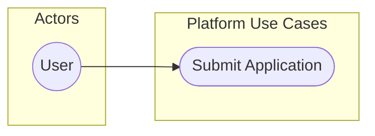

# Mermaid Use Case Diagram Skill

Use when modeling user goals and actor interactions with the system.

## Intent

- Represent external intent and goals, not internal service implementation.
- Keep the actor-to-capability view clean for product and architecture stakeholders.

## Canonical Skeleton

## Required Modeling Rules

- Use `flowchart LR` with explicit actor and system subgraphs.
- Actor labels are role nouns (Guest, User, Admin, Partner API).
- Use case labels are `Verb + Object` (for example `Open Match Chat`).
- Keep labels business-facing; avoid endpoint names in use-case nodes.
- Show include/extend semantics using labeled edges such as `includes` and `extends`.

## Depth Requirements

- Minimum 4 actors in non-trivial systems.
- Minimum 10 use cases.
- Minimum 12 edges (actor/use-case and use-case/use-case).
- Must include at least one operational/admin use case.

## Anti-Patterns

- Avoid CRUD-only lists with no user goal context.
- Avoid placing technical artifacts as actors (like `MongoDB`).
- Avoid mixing flow-order detail (that belongs in activity/sequence).

## Update Protocol

- Preserve use case IDs and labels unless business language changed.
- If a use case is deprecated, keep it for one revision with `deprecated` marker before removal.

## Validation

- Every use case has at least one actor or parent use-case relation.
- Actor scope and system boundary are visually distinct.
- Narrative remains understandable without code-level context.

## References

- https://mermaid.js.org/syntax/flowchart.html
- https://mermaid.js.org/intro/syntax-reference.html
